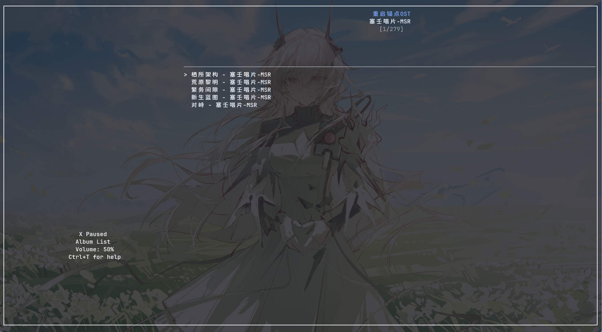
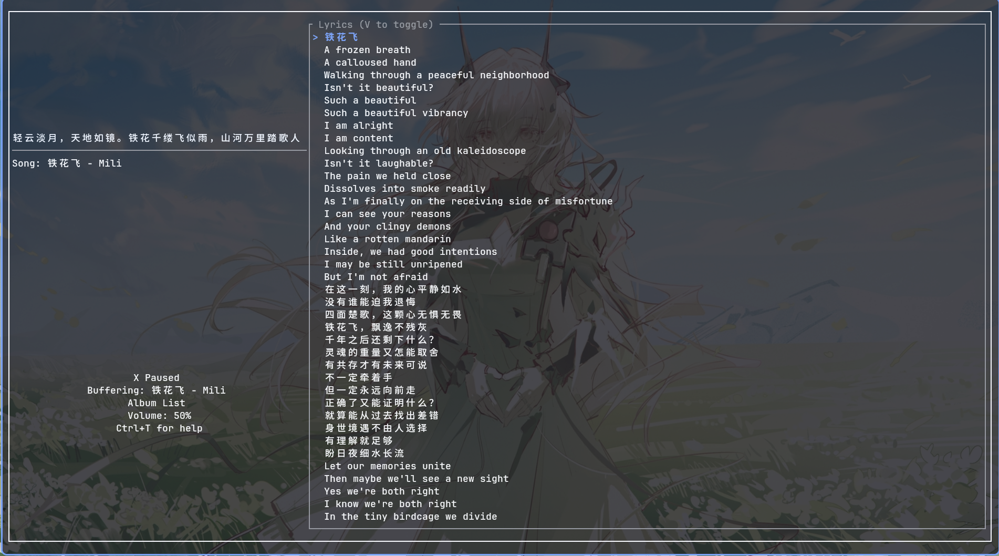

# 🎵 msplayer

**塞壬唱片终端音乐播放器** — 一个基于 Rust 的 Monster Siren 流媒体客户端，以共享内核驱动多 UI 界面。

---

## 🧠 哲学理念

```
┌──────────────────────────────────────────────────┐
│                  🎛️ kernel (内核)                  │
│  ┌──────────┐ ┌──────────┐ ┌──────────────────┐ │
│  │  player  │ │  engine  │ │  api / types     │ │
│  │ 音频播放  │ │ 数据管理  │ │ HTTP 数据模型    │ │
│  └──────────┘ └──────────┘ └──────────────────┘ │
│         纯逻辑 · 零 UI 依赖 · 完全可复用           │
└────────────────────┬─────────────────────────────┘
                     │
        ┌────────────┼────────────┐
        │            │            │
   ┌────▼────┐ ┌─────▼─────┐ ┌───▼──────┐
   │  TUI A  │ │  TUI B    │ │  GUI A   │
   │ ratatui │ │ (未来风格) │ │  egui    │
   └─────────┘ └───────────┘ └──────────┘
   只管渲染    只管渲染       只管渲染
   只管按键    只管按键       只管按键
```

> **一个内核，多个外皮。** UI 层只需关心渲染和按键映射，所有业务逻辑（播放控制、数据缓存、API 调用）由内核统一提供。

---

## 🎨 当前 TUI 主题：origin

唯一内置主题，以简洁分栏布局呈现专辑、歌曲、歌词和控制信息。

### 📸 截图





### 🎬 演示视频

> 👉 [点击下载观看演示视频](introduce/TUI-origin.mp4)

---

## 📦 下载 & 使用

### 🔧 环境要求

- **Rust** 工具链 (1.81+)
- **Linux** 或 **Windows** 终端
- 音频输出设备

### 🚀 从源码构建

```bash
# 克隆仓库
git clone https://github.com/your-username/monster-player.git
cd monster-player

# 构建 (默认 TUI feature)
cargo build --release

# 运行
cargo run --release
```

### 🎮 快捷键一览

| 按键 | 功能 |
|------|------|
| `Space` | ▶️ 播放选中歌曲 |
| `x` | ⏯️ 暂停/恢复 |
| `h`/`l` / `←`/`→` | 🎚️ 切换专辑 |
| `j`/`k` / `↓`/`↑` | 🎵 切换歌曲 |
| `A`/`D` (Shift) | ⏭️ 上一首/下一首（单曲模式则重播） |
| `a`/`d` | ⏪/⏩ 进度后退/前进 5% |
| `e` | 🔀 循环播放模式 |
| `o`/`p` | 🔊 音量 -/+5% |
| `v` | 🎤 歌词视图切换 |
| `Ctrl+T` | ❓ 显示所有快捷键 |
| `q` | 🚪 退出 |

---

<details>
<summary>📂 项目文件结构 & 实现原理 (点击展开)</summary>

### 📁 文件结构

```
monster-player/
│
├── Cargo.toml                     # 项目配置 + feature 开关
├── API.md                         # 塞壬唱片 API 文档
├── README.md                      # 本文件
│
├── introduce/                     # 截图和演示素材
│   ├── TUI-origin.png
│   ├── TUI-origin-1.png
│   └── TUI-origin.mp4
│
├── src/
│   ├── lib.rs                     # 库入口，导出所有 public 模块
│   ├── main.rs                    # 二进制入口，按 feature 分发 TUI/GUI
│   │
│   │  ═══ 🎛️ 内核层 (所有 UI 共享) ═══
│   ├── kernel.rs                  # 引擎核心 (507 行)
│   ├── player.rs                  # 音频播放器 (146 行)
│   ├── api/
│   │   ├── mod.rs                 # 模块声明 (2 行)
│   │   ├── types.rs               # API 响应类型定义 (95 行)
│   │   └── client.rs              # HTTP 客户端 (61 行)
│   ├── error.rs                   # 错误类型 (18 行)
│   └── ascii_art.rs               # 字符画工具 (27 行)
│   │
│   │  ═══ 🖥️ TUI 层 (当前活跃) ═══
│   └── tui/
│       ├── mod.rs                 # 终端初始化 + 事件循环 (47 行)
│       ├── app.rs                 # UI 薄壳 + 按键分发 (91 行)
│       ├── event.rs               # 键盘事件处理 (52 行)
│       └── ui.rs                  # 布局 + 渲染 (318 行)
│   │
│   │  ═══ 🪟 GUI 层 (暂存，未编译) ═══
│       └── origin_gui/
│           └── mod.rs             # egui GUI 原型 (739 行)
│
├── build.sh                       # [待定] 构建脚本
├── clean.sh                       # [待定] 清理脚本
└── install.sh                     # [待定] 安装脚本
```

### 📋 各文件功能

| 文件 | 功能 |
|------|------|
| `kernel.rs` | 🎛️ **核心引擎**。管理所有播放状态、专辑/歌曲数据缓存、歌词解析、音量控制、进度条、预加载策略。所有 UI 层通过 `Engine` 的方法操作和读取 |
| `player.rs` | 🔊 **音频播放器**。封装 `rodio`，提供播放、暂停、跳转、音量、播放进度追踪 |
| `api/types.rs` | 📡 **数据类型**。定义所有 API 响应的 Rust 结构体（`Album`、`SongDetail`、`AlbumDetail` 等） |
| `api/client.rs` | 🌐 **HTTP 客户端**。封装 `ureq`，提供 6 个 API 端点（专辑列表、专辑详情、歌曲列表、歌曲详情、新闻、搜索） |
| `error.rs` | ❌ **错误类型**。统一错误枚举 |
| `tui/mod.rs` | 🖥️ **TUI 入口**。crossterm 原始模式 + 交替屏幕 + ratatui 渲染循环 |
| `tui/app.rs` | 🐚 **TUI 状态壳**。仅 91 行，持有 `Engine` 和 3 个 UI 专属字段 |
| `tui/ui.rs` | 🎨 **TUI 渲染**。所有布局和绘制逻辑，通过 `app.engine.xxx` 读取内核状态 |
| `tui/event.rs` | ⌨️ **TUI 按键**。crossterm 键盘事件 → 调用 `app.xxx()` 方法 |
| `origin_gui/mod.rs` | 🪟 **GUI 原型**。基于 egui 的 frameless 透明窗口，通过 `gui` feature 编译 |

---

### 📚 依赖 crate 及用途

#### 🧩 内核依赖

| crate | 版本 | 文件 | 用途 |
|-------|------|------|------|
| `ureq` | 3 | `api/client.rs` | 🌐 同步 HTTP 客户端，调用塞壬唱片 REST API |
| `serde` + `serde_json` | 1 | `api/types.rs` | 📦 JSON 反序列化，将 API 响应转为 Rust 结构体 |
| `thiserror` | 2 | `error.rs` | 🏷️ 自定义错误类型派生宏 |
| `rodio` | 0.20 | `player.rs` | 🔊 音频播放引擎，管理输出流（`OutputStream`）和播放队列（`Sink`） |
| `symphonia` | 0.5 | `Cargo.toml` | 🎼 音频格式解码后端（AAC, ALAC, FLAC, MP3, OGG, WAV, Vorbis） |
| `directories` | 6 | `Cargo.toml` | 📁 获取平台标准目录 |
| `log` + `env_logger` | 0.4 / 0.11 | `main.rs` | 📝 日志框架 |
| `image` | 0.25 | `ascii_art.rs` | 🖼️ 图片解码，封面下载和字符画转换 |

#### 🖥️ TUI 依赖

| crate | 版本 | 文件 | 用途 |
|-------|------|------|------|
| `ratatui` | 0.29 | `tui/ui.rs` | 🎨 终端 UI 框架。布局（`Layout`+`Constraint`）、控件（`Paragraph`、`Block`）、样式（`Style`、`Color`） |
| `crossterm` | 0.28 | `tui/mod.rs` `tui/event.rs` | 🖥️ 终端控制。原始模式、交替屏幕、键盘事件（`KeyCode`、`KeyModifiers`） |
| `unicode-width` | 0.2 | `Cargo.toml` | 📏 字符宽度计算（CJK 字体正确显示） |

---

### 🔑 关键函数速查

| 函数 | 位置 | 功能 |
|------|------|------|
| `Client::albums()` | `api/client.rs:17` | 📡 获取全量专辑列表 |
| `Client::album_detail(cid)` | `api/client.rs:23` | 📡 获取专辑详情 + 歌曲列表 |
| `Client::song_detail(cid)` | `api/client.rs:39` | 📡 获取歌曲详情 + 音频直链 |
| `Player::play_bytes(data)` | `player.rs:49` | 🔊 将内存 WAV 数据送入 Sink 播放 |
| `Player::play_bytes_at(data, secs)` | `player.rs:62` | ⏩ 从指定秒数跳转播放 |
| `Player::elapsed()` | `player.rs:98` | ⏱️ 当前播放进度（秒），含暂停累加 |
| `Player::duration()` | `player.rs:106` | ⏱️ 曲目总时长（秒） |
| `Player::set_volume(vol)` | `player.rs:92` | 🔊 输出音量控制 (0.0–1.0) |
| `Engine::play_song_at(index)` | `kernel.rs:100` | ▶️ 选歌 + 后台下载 + 播放 |
| `Engine::seek_forward()` | `kernel.rs:166` | ⏩ 进度前跳 5% |
| `Engine::seek_backward()` | `kernel.rs:179` | ⏪ 进度后退 5% |
| `Engine::restart_song()` | `kernel.rs:192` | 🔄 从头重播 |
| `Engine::update_lyric_index()` | `kernel.rs:428` | 🎤 按播放进度匹配歌词行 |
| `parse_lrc(text)` | `kernel.rs:444` | 📝 LRC 歌词解析 |
| `handle_key(app, key)` | `tui/event.rs:15` | ⌨️ 按键分发映射 |

</details>

---

## 🔭 愿景

- [x] 🖥️ **TUI 播放器** — ratatui，终端内全键盘操作
- [ ] 🪟 **GUI 播放器** — egui，独立透明窗口，磨砂玻璃效果
- [ ] 🪟 **Windows .exe 安装包** — NSIS 安装程序，双击安装
- [ ] 📱 **Android 端** — 交叉编译 + Native Activity
- [ ] 📦 **Linux 包管理器** — AUR / deb / rpm 分发
- [ ] 🎨 **多风格 UI** — 同一内核驱动不同视觉风格

欢迎 ⭐ Star、🐛 Issue、🔧 PR！

---

## 🙏 致谢

感谢 **鹰角网络 (Hypergryph)** 和 **塞壬唱片 (Monster Siren Records)** 提供公开 API 与优秀的音乐内容。

> 🎵 [monster-siren.hypergryph.com](https://monster-siren.hypergryph.com/)

---

*⚠️ 本项目为社区开发的非官方客户端，与鹰角网络无附属关系。*
