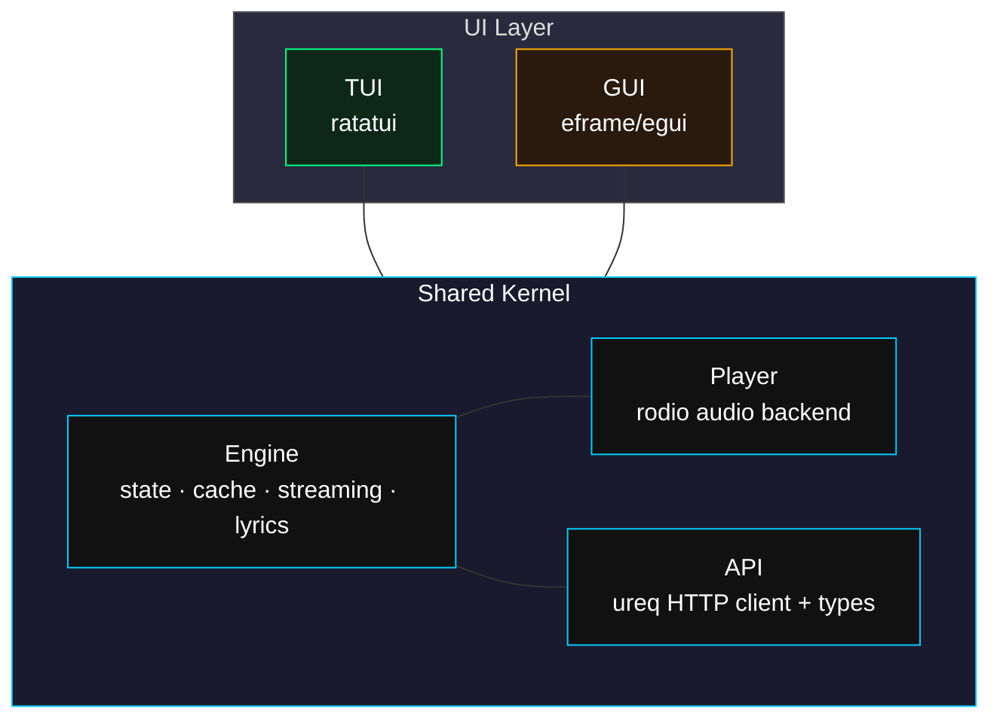

# msplayer

 

> A Monster Siren Records streaming client with shared kernel architecture.

[English](README.md) | [简体中文](README_zh.md) | [日本語](README_ja.md)

---

## Overview

**msplayer** is an unofficial desktop music player for [Monster Siren Records](https://monster-siren.hypergryph.com), the label behind Arknights music. It features a shared-kernel architecture -- all playback logic, data caching, and API interaction live in one core engine, with pluggable frontends.

## Features

| Feature | Description |
|---------|-------------|
| Streaming Playback | Progressive download with 8 MB buffer -- playback begins before the full file is downloaded |
| Terminal UI (TUI) | Full ratatui interface with keyboard-only navigation (vim-style hjkl) |
| Desktop GUI | eframe/egui transparent overlay window, custom title bar, play controls, and search popup |
| Favorites | Toggle favorites with `s`, persisted to `~/.config/msplayer/loved.json` |
| Search | Press `/` to open a Spotlight-style search popup across all albums |
| Synced Lyrics | LRC lyric parsing with real-time highlighting during playback |
| Play Modes | Album List / Album Random / Global List / Global Random / Single / Love List / Love Random |
| Cross-platform | Linux, Windows, macOS -- auto-detects system CJK fonts |
| Themes | 3 built-in themes: Origin (dark cyan), TTY (monochrome), Tokyonight (blue-purple) |

## Screenshots

### TUI

| Main | Lyrics |
|------|--------|
|  |  |

### GUI

| Origin | TTY | Tokyonight |
|--------|-----|------------|
|  |  |  |

## Getting Started

### Pre-built Binaries

Grab the binary for your platform from the [Releases](https://github.com/your-username/monster-player/releases) page:

| File | Platform | Type |
|------|----------|------|
| `msplayer-tui` | Linux x86_64 | TUI |
| `msplayer-gui` | Linux x86_64 | GUI |
| `msplayer-gui.exe` | Windows x86_64 | GUI |

**Linux** -- place the binary in your `PATH` and run it from the terminal:

```bash
chmod +x msplayer-tui msplayer-gui
sudo cp msplayer-tui /usr/local/bin/
sudo cp msplayer-gui /usr/local/bin/

msplayer-tui   # TUI
msplayer-gui   # GUI
```

**Windows** -- just double-click `msplayer-gui.exe` to launch. (๑•̀ㅂ•́)و✧ A proper desktop shortcut and installer are on the way -- please be patient~

### Build from Source

```bash
git clone https://github.com/your-username/monster-player.git
cd monster-player

# TUI
cargo build --release

# GUI
cargo build --release --features gui
```

## Usage

### Keyboard Shortcuts

| Key | Action |
|-----|--------|
| `Space` | Play selected song |
| `x` | Pause / Resume |
| `h` / `l` or `Left` / `Right` | Previous / Next album |
| `j` / `k` or `Down` / `Up` | Previous / Next song (browse mode) |
| `Shift+A` / `Shift+D` | Skip to previous / next song (play immediately) |
| `a` / `d` | Seek backward / forward |
| `e` | Cycle play mode |
| `o` / `p` | Volume down / up |
| `v` | Toggle lyrics view |
| `s` | Toggle favorite |
| `Ctrl+T` | Settings / Help |
| `/` | Search |
| `Esc` | Close popup / Exit search |

### Mouse Controls (GUI only)

| Gesture | Action |
|---------|--------|
| Scroll in right panel | Browse songs |
| Click play mode text | Cycle modes |
| Click `<` / `>` buttons | Previous / Next song |
| Click `||` / `>` toggle | Pause / Play |
| Drag progress bar | Seek |
| Click search icon (top-right) | Open search popup |
| Double-click search result | Jump to song |

## Architecture



## Project Structure

```
src/
├── lib.rs              Library entry
├── main.rs             Binary entry (feature dispatch)
├── kernel.rs           Core engine
├── player.rs           Audio player (rodio)
├── error.rs            Error types
├── api/
│   ├── mod.rs
│   ├── types.rs        API response types
│   └── client.rs       HTTP client (ureq)
├── tui/                Terminal UI
│   ├── mod.rs          crossterm init + event loop
│   ├── app.rs          UI state shell
│   ├── event.rs        Keyboard event mapping
│   └── ui.rs           Layout + rendering
└── origin_gui/         Desktop GUI
    ├── mod.rs          Frameless transparent window
    ├── app.rs          GUI state
    ├── ui.rs           Layout + rendering
    ├── theme.rs        Theme system (3 themes)
    └── settings.rs     Settings popup
```

## Roadmap

- [x] TUI player
- [x] GUI player -- transparent window, custom title bar
- [ ] Windows installer (NSIS / WiX)
- [ ] Linux packages (AUR / deb / rpm)
- [ ] Android port
- [ ] Additional themes

## Credits

Music content powered by [Monster Siren Records](https://monster-siren.hypergryph.com) / Hypergryph.

*This is an unofficial community project, not affiliated with Hypergryph.*

组内邮箱：missercatos@misser.top 或 个人邮箱：catos@misser.top / 303096049@qq.com
