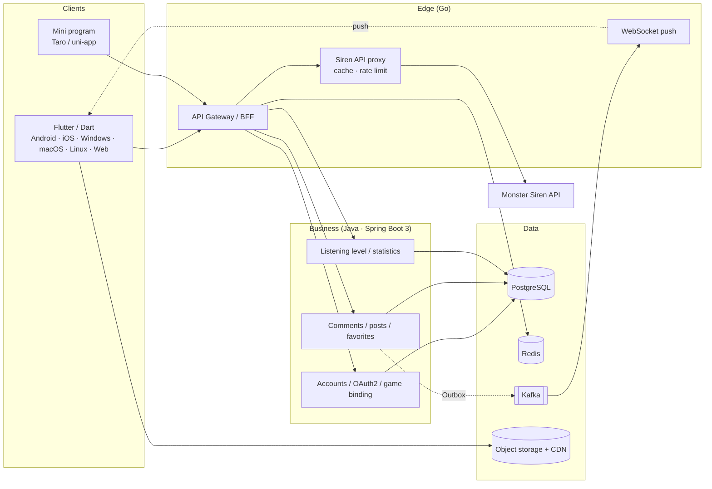

# monster-player · RS

       


> A cross-platform Monster Siren Records music player · Third rebuild · RS series

[English](README.md) | [简体中文](README_zh.md) | [日本語](README_ja.md)

---

## The project is being rebuilt

monster-player is starting its **third rebuild**: a completely new architecture, released as an independent distribution line (RS series, version tag `RS-v`).

- Full plan for the new architecture: [docs/PLAN.md](docs/PLAN.md) (planning stage — implementation has not started)
- The legacy version (Rust kernel + TUI / GUI frontends) remains fully available on the `main` branch, in Releases, and on the AUR
- This branch (`new_ms`) is the starting point of the new architecture: the Monster Siren API reference implementation and contract knowledge are kept; the rest of the old code has been removed

## Why rebuild

The legacy version drove both a TUI and a GUI from one Rust kernel. That proved the shared-kernel idea, but hit clear limits:

| Limit | Description |
|-------|-------------|
| UI expressiveness | A terminal and egui cannot carry complex lyric animations or a modern UI |
| Platform coverage | No mobile path for Android / iOS |
| Online capabilities | No accounts, comments, leaderboards, or push notifications |
| Scale ceiling | A single-machine player architecture cannot support social or high-concurrency workloads |

The new version uses Flutter to cover six platforms with one codebase, a Java + Go backend for business logic and high concurrency, and a data layer of PostgreSQL for the core, Redis for concurrency, and Kafka for decoupling.

## Architecture overview


```mermaid
flowchart LR
    subgraph C["Clients"]
        F["Flutter / Dart<br/>Android · iOS · Windows · macOS · Linux · Web"]
        MP["Mini program<br/>Taro / uni-app"]
    end

    subgraph E["Edge (Go)"]
        GW["API Gateway / BFF"]
        WS["WebSocket push"]
        PX["Siren API proxy<br/>cache · rate limit"]
    end

    subgraph B["Business (Java · Spring Boot 3)"]
        U["Accounts / OAuth2 / game binding"]
        S["Comments / posts / favorites"]
        L["Listening level / statistics"]
    end

    subgraph D["Data"]
        PG[("PostgreSQL")]
        RD[("Redis")]
        KF[["Kafka"]]
        OS[("Object storage + CDN")]
    end

    SIREN["Monster Siren API"]

    F --> GW
    MP --> GW
    GW --> U
    GW --> S
    GW --> L
    GW --> PX
    U --> PG
    S --> PG
    L --> PG
    GW --> RD
    S -. Outbox .-> KF
    KF --> WS
    WS -. push .-> F
    PX --> SIREN
    F --> OS
```

## Technology stack

| Layer | Choice |
|-------|--------|
| Client (App / desktop / web) | Flutter + Dart |
| Client (mini program) | Taro / uni-app + TypeScript |
| Client local database | Drift (SQLite) |
| Backend (business) | Java + Spring Boot 3 |
| Backend (high concurrency) | Go + Gin/Echo |
| Backend (reserved) | Rust, Python, Node.js |
| Relational database | PostgreSQL |
| Cache / ranking | Redis |
| Message queue | Kafka |
| Search | Elasticsearch (optional) |
| Object storage | S3 / OSS + CDN |
| Contracts | OpenAPI + gRPC/Protobuf + AsyncAPI |
| Containers | Docker |
| Orchestration | Kubernetes |
| Service mesh | Istio |
| API gateway | Kong / Envoy / APISIX |
| Multi-language build | Bazel or unified CI |
| Observability | OpenTelemetry + Prometheus + Grafana + Loki |
| Config / feature flags | Nacos / Apollo + Unleash |
| Admin frontend | React + Ant Design |

## Contract-driven

Contracts are the single source of truth. Every language generates its SDK from `contracts/`; interface definitions are never hand-written.

| Contract | Technology | Purpose |
|----------|------------|---------|
| REST API | OpenAPI 3.0 | Public interfaces, auto-generated SDKs for every language |
| Internal calls | gRPC + Protobuf | Java ↔ Go ↔ future languages, typed and fast |
| Async events | AsyncAPI | Kafka event schemas for new modules to subscribe |
| Shared schemas | JSON Schema | Playback events, user actions, and more |

See [contracts/README.md](contracts/README.md) for details.

## Target repository layout

```
monster-player/
├── clients/
│   └── flutter/          # Flutter client (one codebase, six platforms)
├── services/
│   ├── java/             # Spring Boot business services
│   ├── go/               # Gateway / BFF / events / Siren proxy
│   ├── rust/             # Reserved: audio processing, transcoding
│   └── python/           # Reserved: AI recommendations, analytics
├── contracts/            # Single source of truth (OpenAPI / Protobuf / AsyncAPI)
├── admin/                # Admin frontend (React + Ant Design)
├── deploy/               # Docker / Kubernetes / Helm
├── tools/
│   └── siren-ref/        # Monster Siren API reference implementation (Rust CLI)
└── docs/                 # Planning and API documents
```

## What this branch keeps

This branch is a clean-up plus groundwork; only the assets needed for rebuilding remain:

| Asset | Description |
|-------|-------------|
| [docs/monster-siren-api.md](docs/monster-siren-api.md) | Monster Siren API contract knowledge: endpoints, fields, error codes, CDN URL formats |
| [tools/siren-ref](tools/siren-ref) | Verified Rust reference client (CLI): fetch real responses as JSON fixtures for contract tests and gateway comparison |
| [contracts/](contracts/) | Contract directory placeholder and conventions |
| [docs/PLAN.md](docs/PLAN.md) | Full third-rebuild plan |

The old Rust kernel, TUI / GUI frontends, C FFI layer, Python bindings, AUR packaging, and old CI have been removed from this branch and can still be found on `main`.

## Why keep a Rust tool

In the new architecture Rust no longer plays the interface role — contracts (OpenAPI / Protobuf / AsyncAPI) are the single source of truth, and the Siren proxy will be implemented in Go. But the old Rust client is a Siren API reference implementation verified against real data, so it was trimmed into `tools/siren-ref`:

- Fetch real responses and generate contract-test fixtures
- Serve as a comparison baseline for the Go proxy (`--base-url` can point at the future Go gateway)
- Stay consistent with the "Rust reserved: audio processing, transcoding" stack position

## Roadmap

- [ ] P0 Contracts and skeleton: contracts bootstrap, CI, code-generation pipeline
- [ ] P1 Go edge layer: API gateway / BFF, Siren API proxy (cache + rate limit), WebSocket channel
- [ ] P2 Java business layer: accounts and Hypergryph OAuth2, game binding, favorites, comments, posts
- [ ] P3 Go high-concurrency: playback event sync, counters, Redis leaderboards
- [ ] P4 Flutter client: three-platform shell, playback engine, in-house timestamped lyric animation engine
- [ ] P5 Data and operations: Kafka events, Flyway migrations, observability, K8s deployment
- [ ] P6 Admin console and statistics

## Legacy version

| Channel | Description |
|---------|-------------|
| `main` branch | Full legacy source (Rust kernel + TUI + GUI) |
| Releases | Pre-built `msplayer-tui` / `msplayer-gui` / `msplayer-gui.exe` binaries |
| AUR | `yay -S msplayer-tui` |

## Credits

Music content powered by [Monster Siren Records](https://monster-siren.hypergryph.com) / Hypergryph.

*This is an unofficial community project, not affiliated with Hypergryph.*

组内邮箱：missercatos@misser.top 或 个人邮箱：catos@misser.top / 303096049@qq.com
