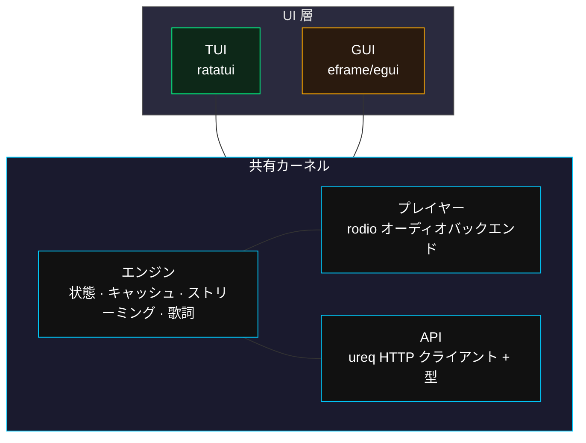

# msplayer

> 共有カーネルアーキテクチャの Monster Siren Records ストリーミングクライアント。

[English](README.md) | [简体中文](README_zh.md) | [日本語](README_ja.md)

---

## 概要

**msplayer** は、[Monster Siren Records](https://monster-siren.hypergryph.com) の非公式デスクトップ音楽プレイヤーです。共有カーネルアーキテクチャを採用し、再生ロジック、データキャッシュ、API通信はすべてコアエンジンに集約。UIはプラグイン可能です。

## 機能

| 機能 | 説明 |
|------|------|
| ストリーミング再生 | プログレッシブダウンロード、8 MBバッファ -- ダウンロード完了前に再生開始 |
| 端末 UI (TUI) | ratatui による全画面インターフェース、キーボードのみで操作（vim 風 hjkl） |
| デスクトップ GUI | eframe/egui 透明オーバーレイウィンドウ、カスタムタイトルバー、再生コントロール、検索ポップアップ |
| お気に入り | `s` キーでお気に入り登録 -- `~/.config/msplayer/loved.json` に永続化 |
| 検索 | `/` キーで Spotlight 風の検索ポップアップ -- 全アルバム横断検索 |
| 同期歌詞 | LRC 歌詞解析、再生位置に合わせてリアルタイムハイライト |
| 再生モード | アルバム順 / アルバムランダム / 全曲順 / 全曲ランダム / 単曲リピート / お気に入り順 / お気に入りランダム |
| クロスプラットフォーム | Linux、Windows、macOS -- システムの CJK フォントを自動検出 |
| テーマ | 3 種類の内蔵テーマ: Origin（ダークシアン）、TTY（モノクロ）、Tokyonight（青紫） |

## スクリーンショット

### TUI

| メイン | 歌詞 |
|--------|------|
|  |  |

### GUI

| Origin | TTY | Tokyonight |
|--------|-----|------------|
|  |  |  |

## インストール

### 必要条件

- Rust ツールチェーン 1.81+
- オーディオ出力デバイス

### ソースからビルド

```bash
git clone https://github.com/your-username/monster-player.git
cd monster-player

# TUI (デフォルト feature)
cargo build --release

# GUI
cargo build --release --features gui

# 実行
cargo run --release
```

## 使用方法

### キーボードショートカット

| キー | 操作 |
|------|------|
| `Space` | 選択曲を再生 |
| `x` | 一時停止 / 再開 |
| `h` / `l` または `Left` / `Right` | 前 / 次のアルバム |
| `j` / `k` または `Down` / `Up` | 前 / 次の曲（閲覧モード） |
| `Shift+A` / `Shift+D` | 前 / 次の曲へスキップ（即時再生） |
| `a` / `d` | シーク（戻る / 進む） |
| `e` | 再生モード切替 |
| `o` / `p` | 音量 下 / 上 |
| `v` | 歌詞表示切替 |
| `s` | お気に入り切替 |
| `Ctrl+T` | 設定 / ヘルプ |
| `/` | 検索 |
| `Esc` | ポップアップを閉じる / 検索終了 |

### マウス操作（GUI のみ）

| 操作 | 効果 |
|------|------|
| 右パネルでスクロール | 曲の閲覧 |
| 再生モードテキストをクリック | モード切替 |
| `<` / `>` ボタンをクリック | 前 / 次の曲 |
| `||` / `>` 切替をクリック | 一時停止 / 再生 |
| プログレスバーをドラッグ | シーク |
| 検索アイコン（右上）をクリック | 検索ポップアップを開く |
| 検索結果をダブルクリック | 曲へジャンプ |

## アーキテクチャ



## プロジェクト構造

```
src/
├── lib.rs              ライブラリエントリ
├── main.rs             バイナリエントリ (feature 分岐)
├── kernel.rs           コアエンジン
├── player.rs           オーディオプレイヤー (rodio)
├── error.rs            エラー型
├── api/
│   ├── mod.rs
│   ├── types.rs        API レスポンス型
│   └── client.rs       HTTP クライアント (ureq)
├── tui/                端末 UI
│   ├── mod.rs          crossterm 初期化 + イベントループ
│   ├── app.rs          UI 状態シェル
│   ├── event.rs        キーボードイベントマッピング
│   └── ui.rs           レイアウト + レンダリング
└── origin_gui/         デスクトップ GUI
    ├── mod.rs          枠なし透明ウィンドウ
    ├── app.rs          GUI 状態
    ├── ui.rs           レイアウト + レンダリング
    ├── theme.rs        テーマシステム (3 テーマ)
    └── settings.rs     設定ポップアップ
```

## ロードマップ

- [x] TUI プレイヤー
- [x] GUI プレイヤー -- 透明ウィンドウ、カスタムタイトルバー
- [ ] Windows インストーラ (NSIS / WiX)
- [ ] Linux パッケージ (AUR / deb / rpm)
- [ ] Android 移植
- [ ] 追加テーマ

## クレジット

音楽コンテンツは [Monster Siren Records](https://monster-siren.hypergryph.com) / Hypergryph により提供されています。

*本プロジェクトはコミュニティ開発の非公式クライアントであり、Hypergryph とは無関係です。*
