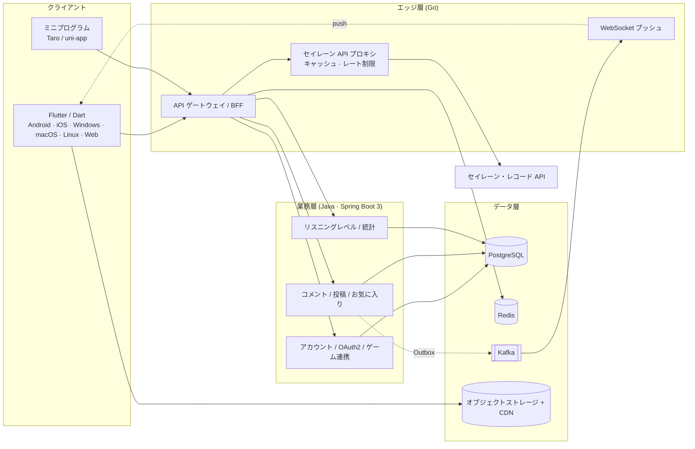

# monster-player · RS

       


> セイレーン・レコード (Monster Siren Records) クロスプラットフォームプレイヤー · 三度目のリビルド · RS シリーズ

[English](README.md) | [简体中文](README_zh.md) | [日本語](README_ja.md)

---

## プロジェクトはリビルド中です

monster-player は**三度目のリビルド**を開始します。まったく新しいアーキテクチャで再構築し、独立したディストリビューション（RS シリーズ、バージョンタグ `RS-v`）としてリリースします。

- 新アーキテクチャの全計画は [docs/PLAN.md](docs/PLAN.md)（現在は計画段階で、実装は未着手）
- 旧バージョン（Rust カーネル + TUI / GUI）は `main` ブランチ、Releases、AUR で引き続き利用できます
- このブランチ（`new_ms`）は新アーキテクチャの出発点です。セイレーン API のリファレンス実装と契約知識を保持し、それ以外の旧コードは削除しました

## なぜリビルドするのか

旧バージョンは 1 つの Rust カーネルで TUI と GUI を駆動し、「共有カーネル」の可能性を実証しましたが、限界も明確になりました：

| 限界 | 説明 |
|------|------|
| UI 表現力 | ターミナルと egui では複雑な歌詞アニメーションや現代的な UI を実現しにくい |
| プラットフォーム | Android / iOS へのモバイル展開の道がない |
| オンライン機能 | アカウント、コメント、ランキング、プッシュ通知などの機能がない |
| 規模の上限 | 単体プレイヤー構成ではソーシャルや高並行のワークロードを支えられない |

新バージョンは Flutter で 6 プラットフォームを 1 つのコードベースでカバーし、Java + Go のバックエンドで業務処理と高並行を担い、データ層は PostgreSQL が中核、Redis が並行処理、Kafka が疎結合を担当します。

## アーキテクチャ概要


```mermaid
flowchart LR
    subgraph C["クライアント"]
        F["Flutter / Dart<br/>Android · iOS · Windows · macOS · Linux · Web"]
        MP["ミニプログラム<br/>Taro / uni-app"]
    end

    subgraph E["エッジ層 (Go)"]
        GW["API ゲートウェイ / BFF"]
        WS["WebSocket プッシュ"]
        PX["セイレーン API プロキシ<br/>キャッシュ · レート制限"]
    end

    subgraph B["業務層 (Java · Spring Boot 3)"]
        U["アカウント / OAuth2 / ゲーム連携"]
        S["コメント / 投稿 / お気に入り"]
        L["リスニングレベル / 統計"]
    end

    subgraph D["データ層"]
        PG[("PostgreSQL")]
        RD[("Redis")]
        KF[["Kafka"]]
        OS[("オブジェクトストレージ + CDN")]
    end

    SIREN["セイレーン・レコード API"]

    F --> GW
    MP --> GW
    GW --> U
    GW --> S
    GW --> L
    GW --> PX
    U --> PG
    S --> PG
    L --> PG
    GW --> RD
    S -. Outbox .-> KF
    KF --> WS
    WS -. push .-> F
    PX --> SIREN
    F --> OS
```

## 技術スタック総表

| 層 | 技術選定 |
|----|----------|
| クライアント（App / デスクトップ / Web） | Flutter + Dart |
| クライアント（ミニプログラム） | Taro / uni-app + TypeScript |
| クライアントローカル DB | Drift (SQLite) |
| バックエンド（業務） | Java + Spring Boot 3 |
| バックエンド（高並行） | Go + Gin/Echo |
| バックエンド（予約） | Rust、Python、Node.js |
| リレーショナル DB | PostgreSQL |
| キャッシュ / ランキング | Redis |
| メッセージキュー | Kafka |
| 検索 | Elasticsearch（任意） |
| オブジェクトストレージ | S3 / OSS + CDN |
| 契約 | OpenAPI + gRPC/Protobuf + AsyncAPI |
| コンテナ | Docker |
| オーケストレーション | Kubernetes |
| サービスメッシュ | Istio |
| API ゲートウェイ | Kong / Envoy / APISIX |
| 多言語ビルド | Bazel または CI による統合 |
| 可観測性 | OpenTelemetry + Prometheus + Grafana + Loki |
| 設定 / フィーチャーフラグ | Nacos / Apollo + Unleash |
| 管理画面フロントエンド | React + Ant Design |

## 契約駆動

契約は唯一の正となる情報源です。すべての言語は `contracts/` から SDK を生成し、インターフェース定義を手書きしません。

| 契約 | 技術 | 用途 |
|------|------|------|
| REST API | OpenAPI 3.0 | 対外インターフェース、各言語 SDK を自動生成 |
| 内部通信 | gRPC + Protobuf | Java ↔ Go ↔ 将来の言語、高性能で型安全 |
| 非同期イベント | AsyncAPI | Kafka イベント schema、新モジュールが購読 |
| 共通 Schema | JSON Schema | 再生イベント、ユーザー操作など |

詳細は [contracts/README.md](contracts/README.md) を参照。

## 目標リポジトリ構成

```
monster-player/
├── clients/
│   └── flutter/          # Flutter クライアント（6 プラットフォーム）
├── services/
│   ├── java/             # Spring Boot 業務サービス
│   ├── go/               # ゲートウェイ / BFF / イベント / セイレーンプロキシ
│   ├── rust/             # 予約：音声処理、トランスコード
│   └── python/           # 予約：AI レコメンド、データ分析
├── contracts/            # 契約の唯一の正（OpenAPI / Protobuf / AsyncAPI）
├── admin/                # 管理画面フロントエンド（React + Ant Design）
├── deploy/               # Docker / Kubernetes / Helm
├── tools/
│   └── siren-ref/        # セイレーン API リファレンス実装（Rust CLI）
└── docs/                 # 計画と API ドキュメント
```

## このブランチが保持しているもの

このブランチは「整理 + 基礎固め」です。再構築に必要な資産のみを残しています：

| 資産 | 説明 |
|------|------|
| [docs/monster-siren-api.md](docs/monster-siren-api.md) | セイレーン・レコード API の契約知識：エンドポイント、フィールド、エラーコード、CDN URL 形式 |
| [tools/siren-ref](tools/siren-ref) | 検証済み Rust リファレンスクライアント（CLI）：実レスポンスを JSON fixture として取得し、契約テストとゲートウェイ比較に利用 |
| [contracts/](contracts/) | 契約ディレクトリのプレースホルダと規約 |
| [docs/PLAN.md](docs/PLAN.md) | 三度目のリビルド完全計画 |

旧 Rust カーネル、TUI / GUI フロントエンド、C FFI レイヤー、Python バインディング、AUR パッケージ、旧 CI はこのブランチから削除済みで、`main` から入手できます。

## なぜ Rust ツールを残すのか

新アーキテクチャで Rust はインターフェースの役割を担いません —— 契約（OpenAPI / Protobuf / AsyncAPI）が唯一の正であり、セイレーンプロキシは Go で実装します。しかし旧 Rust クライアントは実データで検証済みのセイレーン API リファレンス実装であるため、`tools/siren-ref` に絞り込みました：

- 実レスポンスを取得し、契約テスト用 fixture を生成
- Go プロキシ実装の比較基準（`--base-url` で将来の Go ゲートウェイを指定可能）
- 「Rust 予約：音声処理、トランスコード」というスタック上の位置づけと整合

## ロードマップ

- [ ] P0 契約と骨格：contracts 初期化、CI、コード生成パイプライン
- [ ] P1 Go エッジ層：API ゲートウェイ / BFF、セイレーン API プロキシ（キャッシュ + レート制限）、WebSocket チャネル
- [ ] P2 Java 業務層：アカウントと Hypergryph OAuth2、ゲーム連携、お気に入り、コメント、投稿
- [ ] P3 Go 高並行：再生イベント同期、カウンタ、Redis ランキング
- [ ] P4 Flutter クライアント：3 プラットフォームのシェル、再生エンジン、自作タイムスタンプ歌詞アニメーションエンジン
- [ ] P5 データと運用：Kafka イベント、Flyway マイグレーション、可観測性、K8s デプロイ
- [ ] P6 管理画面と統計

## 旧バージョン

| チャネル | 説明 |
|----------|------|
| `main` ブランチ | 旧版の完全なソース（Rust カーネル + TUI + GUI） |
| Releases | `msplayer-tui` / `msplayer-gui` / `msplayer-gui.exe` のビルド済みバイナリ |
| AUR | `yay -S msplayer-tui` |

## クレジット

音楽コンテンツは [セイレーン・レコード (Monster Siren Records)](https://monster-siren.hypergryph.com) / Hypergryph により提供されています。

*本プロジェクトはコミュニティ開発の非公式クライアントであり、Hypergryph とは無関係です。*

組内メール：missercatos@misser.top または 個人メール：catos@misser.top / 303096049@qq.com
