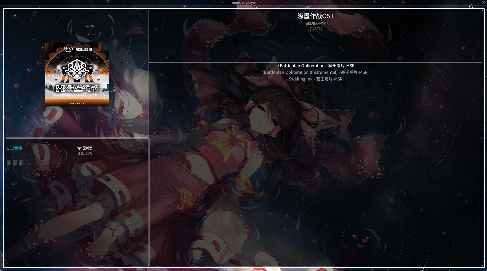
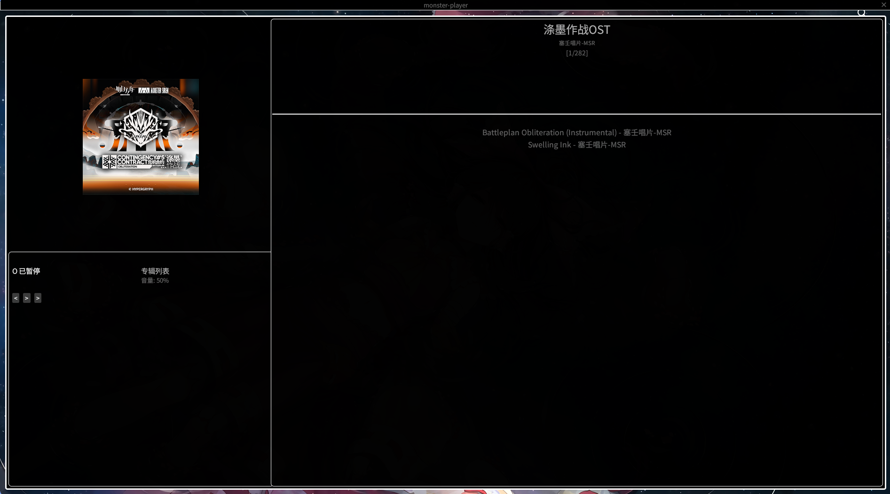
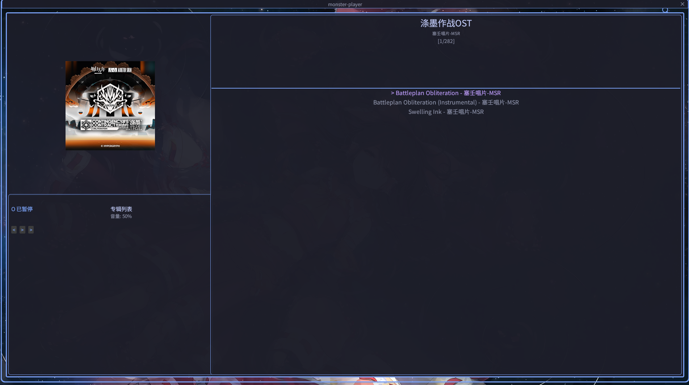
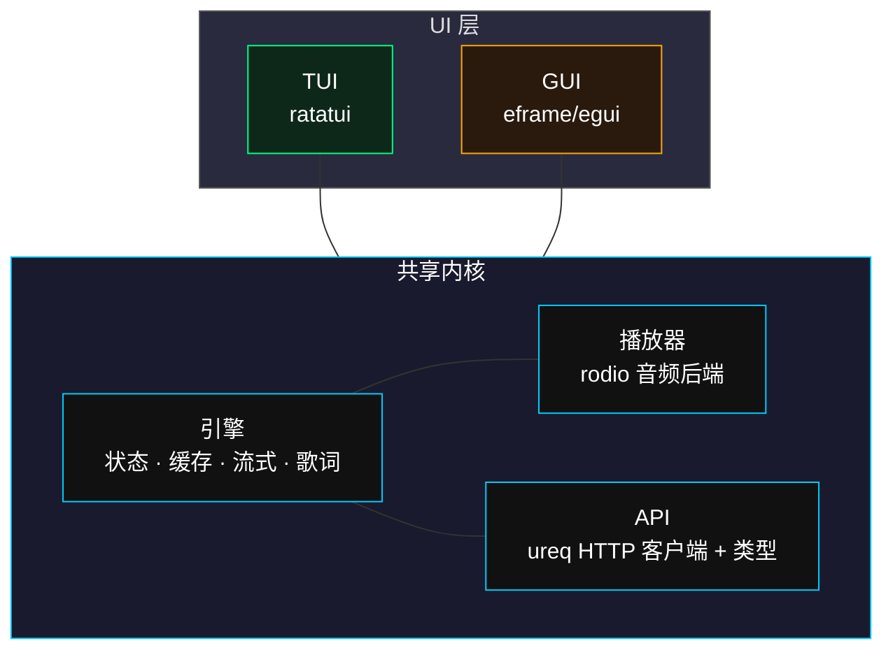

# msplayer

> 共享内核架构的塞壬唱片流媒体客户端。

[English](README.md) | [简体中文](README_zh.md) | [日本語](README_ja.md)

---

## 概述

**msplayer** 是一款非官方的 [塞壬唱片](https://monster-siren.hypergryph.com) 桌面音乐播放器，采用共享内核架构 -- 所有播放逻辑、数据缓存和 API 交互集中在核心引擎中，UI 层可插拔替换。

## 功能

| 功能 | 说明 |
|------|------|
| 流式播放 | 渐进式下载，8 MB 缓冲 -- 歌曲在完整下载完成前即可开始播放 |
| 终端界面 (TUI) | 全 ratatui 界面，纯键盘操作（vim 风格 hjkl） |
| 桌面 GUI | eframe/egui 透明悬浮窗口，自定义标题栏、播放控件和搜索弹窗 |
| 收藏系统 | 按 `s` 收藏/取消收藏，持久化到 `~/.config/msplayer/loved.json` |
| 搜索 | 按 `/` 打开 Spotlight 风格搜索弹窗，跨专辑搜索 |
| 同步歌词 | LRC 歌词解析，播放时实时高亮当前歌词行 |
| 播放模式 | 专辑列表 / 专辑随机 / 全局列表 / 全局随机 / 单曲循环 / 收藏列表 / 收藏随机 |
| 跨平台 | Linux、Windows、macOS -- 自动检测系统 CJK 字体 |
| 主题 | 3 套内置主题：Origin（暗色青）、TTY（黑白）、Tokyonight（蓝紫） |

## 截图

### TUI

| 主界面 | 歌词 |
|--------|------|
|  |  |

### GUI

| Origin | TTY | Tokyonight |
|--------|-----|------------|
|  |  |  |

## 快速开始

### 预编译二进制

从 [Releases](https://github.com/your-username/monster-player/releases) 页面下载对应平台的二进制文件：

| 文件 | 平台 | 类型 |
|------|------|------|
| `msplayer-tui` | Linux x86_64 | TUI |
| `msplayer-gui` | Linux x86_64 | GUI |
| `msplayer-gui.exe` | Windows x86_64 | GUI |

**Linux** -- 将二进制文件放入 `PATH`，终端直接运行：

```bash
chmod +x msplayer-tui msplayer-gui
sudo cp msplayer-tui /usr/local/bin/
sudo cp msplayer-gui /usr/local/bin/

msplayer-tui   # TUI
msplayer-gui   # GUI
```

**Windows** -- 双击 `msplayer-gui.exe` 即可启动。(๑•̀ㅂ•́)و✧ 桌面快捷方式和安装包正在制作中，请耐心等待~

### 从源码构建

```bash
git clone https://github.com/your-username/monster-player.git
cd monster-player

# TUI
cargo build --release

# GUI
cargo build --release --features gui
```

## 使用说明

### 快捷键

| 按键 | 功能 |
|------|------|
| `Space` | 播放选中歌曲 |
| `x` | 暂停 / 恢复 |
| `h` / `l` 或 `Left` / `Right` | 上 / 下专辑 |
| `j` / `k` 或 `Down` / `Up` | 上 / 下歌曲（浏览模式） |
| `Shift+A` / `Shift+D` | 上一首 / 下一首（立即播放） |
| `a` / `d` | 进度后退 / 前进 |
| `e` | 切换播放模式 |
| `o` / `p` | 音量减 / 增 |
| `v` | 歌词显示切换 |
| `s` | 收藏 / 取消收藏 |
| `Ctrl+T` | 设置 / 帮助 |
| `/` | 搜索 |
| `Esc` | 关闭弹窗 / 退出搜索 |

### 鼠标操作（仅 GUI）

| 操作 | 效果 |
|------|------|
| 右侧面板滚轮 | 浏览歌曲 |
| 点击播放模式文字 | 切换模式 |
| 点击 `<` / `>` 按钮 | 上一首 / 下一首 |
| 点击 `||` / `>` 切换 | 暂停 / 播放 |
| 拖拽进度条 | 跳转进度 |
| 点击搜索图标（右上角） | 打开搜索弹窗 |
| 双击搜索结果 | 跳转到歌曲 |

## 架构



## 项目结构

```
src/
├── lib.rs              库入口
├── main.rs             二进制入口 (feature 分发)
├── kernel.rs           核心引擎
├── player.rs           音频播放器 (rodio)
├── error.rs            错误类型
├── api/
│   ├── mod.rs
│   ├── types.rs        API 响应类型
│   └── client.rs       HTTP 客户端 (ureq)
├── tui/                终端界面
│   ├── mod.rs          crossterm 初始化 + 事件循环
│   ├── app.rs          UI 状态壳
│   ├── event.rs        键盘事件映射
│   └── ui.rs           布局 + 渲染
└── origin_gui/         桌面 GUI
    ├── mod.rs          无边框透明窗口
    ├── app.rs          GUI 状态
    ├── ui.rs           布局 + 渲染
    ├── theme.rs        主题系统 (3 套主题)
    └── settings.rs     设置弹窗
```

## 路线图

- [x] TUI 播放器
- [x] GUI 播放器 -- 透明窗口，自定义标题栏
- [ ] Windows 安装程序 (NSIS / WiX)
- [ ] Linux 包管理 (AUR / deb / rpm)
- [ ] Android 移植
- [ ] 更多主题

## 致谢

音乐内容由 [塞壬唱片 (Monster Siren Records)](https://monster-siren.hypergryph.com) / 鹰角网络提供。

*本项目为社区开发的非官方客户端，与鹰角网络无附属关系。*
