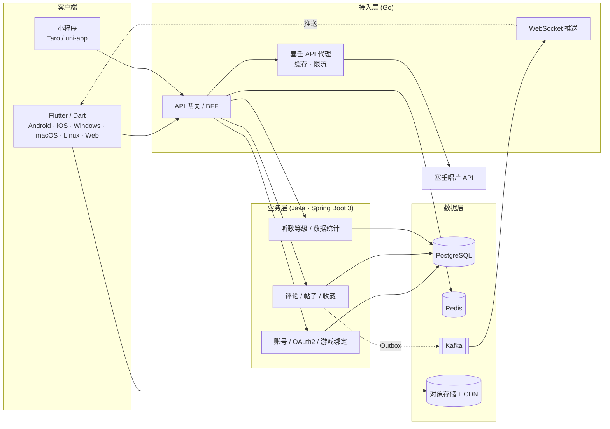

# monster-player · RS

       


> 塞壬唱片 (Monster Siren Records) 跨平台音乐播放器 · 第三次重构 · RS 系列

[English](README.md) | [简体中文](README_zh.md) | [日本語](README_ja.md)

---

## 项目正在重构

monster-player 即将启动**第三次重构**，以全新的架构重建，并作为独立发行版（RS 系列，版本标签 `RS-v`）发布。

- 新架构的完整规划见 [docs/PLAN.md](docs/PLAN.md)（当前为规划阶段，尚未开始实现）
- 旧版本（Rust 内核 + TUI / GUI 双前端）完整保留在 `main` 分支、Releases 与 AUR，继续可用
- 本分支（`new_ms`）是新架构的起点：保留了塞壬 API 参考实现与契约知识，其余旧代码已清理

## 为什么要重构

旧版用一个 Rust 内核同时驱动 TUI 与 GUI，验证了"共享内核"的可行性，但也遇到了瓶颈：

| 瓶颈 | 说明 |
|------|------|
| 前端表现力 | 终端与 egui 难以承载复杂的歌词动画与现代化 UI |
| 平台覆盖 | 移动端缺失，Android / iOS 无路径 |
| 服务端能力 | 无账号、评论、排行榜、推送等在线能力 |
| 规模上限 | 单机播放器架构无法支撑社交与高并发场景 |

新版本选择 Flutter 一套代码覆盖三端，后端以 Java + Go 双栈承载业务与高并发，数据层以 PostgreSQL 保核心、Redis 抗并发、Kafka 削峰解耦。

## 新架构总览


```mermaid
flowchart LR
    subgraph C["客户端"]
        F["Flutter / Dart<br/>Android · iOS · Windows · macOS · Linux · Web"]
        MP["小程序<br/>Taro / uni-app"]
    end

    subgraph E["接入层 (Go)"]
        GW["API 网关 / BFF"]
        WS["WebSocket 推送"]
        PX["塞壬 API 代理<br/>缓存 · 限流"]
    end

    subgraph B["业务层 (Java · Spring Boot 3)"]
        U["账号 / OAuth2 / 游戏绑定"]
        S["评论 / 帖子 / 收藏"]
        L["听歌等级 / 数据统计"]
    end

    subgraph D["数据层"]
        PG[("PostgreSQL")]
        RD[("Redis")]
        KF[["Kafka"]]
        OS[("对象存储 + CDN")]
    end

    SIREN["塞壬唱片 API"]

    F --> GW
    MP --> GW
    GW --> U
    GW --> S
    GW --> L
    GW --> PX
    U --> PG
    S --> PG
    L --> PG
    GW --> RD
    S -. Outbox .-> KF
    KF --> WS
    WS -. 推送 .-> F
    PX --> SIREN
    F --> OS
```

## 技术栈总表

| 层次 | 技术选型 |
|------|----------|
| 客户端（App/桌面/Web） | Flutter + Dart |
| 客户端（小程序） | Taro / uni-app + TypeScript |
| 客户端本地库 | Drift (SQLite) |
| 后端（业务） | Java + Spring Boot 3 |
| 后端（高并发） | Go + Gin/Echo |
| 后端（预留） | Rust、Python、Node.js |
| 关系数据库 | PostgreSQL |
| 缓存/排行 | Redis |
| 消息队列 | Kafka |
| 搜索 | Elasticsearch（可选） |
| 对象存储 | S3 / OSS + CDN |
| 契约 | OpenAPI + gRPC/Protobuf + AsyncAPI |
| 容器 | Docker |
| 编排 | Kubernetes |
| 服务网格 | Istio |
| API 网关 | Kong / Envoy / APISIX |
| 多语言构建 | Bazel 或 CI 统一调度 |
| 可观测性 | OpenTelemetry + Prometheus + Grafana + Loki |
| 配置/开关 | Nacos / Apollo + Unleash |
| 后台前端 | React + Ant Design |

## 契约驱动

契约是唯一真相源。所有语言从 `contracts/` 生成 SDK，不手写接口定义。

| 契约 | 技术 | 用途 |
|------|------|------|
| REST API | OpenAPI 3.0 | 对外接口，自动生成各语言 SDK |
| 内部通信 | gRPC + Protobuf | Java ↔ Go ↔ 未来语言，高性能强类型 |
| 异步事件 | AsyncAPI | Kafka 事件 schema，新模块订阅 |
| 通用 Schema | JSON Schema | 播放事件、用户操作等 |

细节见 [contracts/README.md](contracts/README.md)。

## 目标仓库结构

```
monster-player/
├── clients/
│   └── flutter/          # Flutter 客户端（三端同源）
├── services/
│   ├── java/             # Spring Boot 业务服务
│   ├── go/               # 网关 / BFF / 事件 / 塞壬代理
│   ├── rust/             # 预留：音频处理、转码
│   └── python/           # 预留：AI 推荐、数据分析
├── contracts/            # 契约唯一真相源（OpenAPI / Protobuf / AsyncAPI）
├── admin/                # 后台管理前端（React + Ant Design）
├── deploy/               # Docker / Kubernetes / Helm
├── tools/
│   └── siren-ref/        # 塞壬 API 参考实现（Rust CLI）
└── docs/                 # 规划与接口文档
```

## 当前分支保留了什么

本分支是一次"清理 + 奠基"，只保留重建所需的资产：

| 资产 | 说明 |
|------|------|
| [docs/monster-siren-api.md](docs/monster-siren-api.md) | 塞壬唱片 API 契约知识：端点、字段、错误码、CDN 直链格式 |
| [tools/siren-ref](tools/siren-ref) | 经过验证的 Rust 参考客户端（CLI）：可拉取真实响应生成 JSON fixture，供契约测试与网关对照验证 |
| [contracts/](contracts/) | 契约目录占位与约定说明 |
| [docs/PLAN.md](docs/PLAN.md) | 第三次重构完整规划 |

旧 Rust 内核、TUI / GUI 前端、C FFI 绑定、Python bindings、AUR 打包与旧 CI 已从本分支移除，全部可从 `main` 找回。

## 为什么保留一个 Rust 工具

新架构中 Rust 不再承担接口角色 —— 契约（OpenAPI / Protobuf / AsyncAPI）才是唯一真相源，塞壬代理由 Go 实现。但旧 Rust 客户端是一份经过真实数据验证的塞壬 API 参考实现，因此精简为 `tools/siren-ref`：

- 拉取真实响应，生成契约测试 fixture
- 作为 Go 代理实现的对照物（`--base-url` 可指向未来的 Go 网关，对比响应差异）
- 与"Rust 预留：音频处理、转码"的技术栈定位一致

## 路线图

- [ ] P0 契约与仓库骨架：contracts 初始化、CI、代码生成流水线
- [ ] P1 Go 接入层：API 网关 / BFF、塞壬 API 代理（缓存 + 限流）、WebSocket 通道
- [ ] P2 Java 业务层：账号与鹰角通行证 OAuth2、游戏绑定、收藏、评论、帖子
- [ ] P3 Go 高并发：播放事件同步、计数、Redis 排行榜
- [ ] P4 Flutter 客户端：三端壳工程 + 播放引擎 + 自研时间戳歌词动画引擎
- [ ] P5 数据与运维：Kafka 事件、Flyway 迁移、可观测性、K8s 部署
- [ ] P6 后台管理与数据统计

## 旧版本

| 渠道 | 说明 |
|------|------|
| `main` 分支 | 旧版完整源码（Rust 内核 + TUI + GUI） |
| Releases | `msplayer-tui` / `msplayer-gui` / `msplayer-gui.exe` 预编译二进制 |
| AUR | `yay -S msplayer-tui` |

## 致谢

音乐内容由 [塞壬唱片 (Monster Siren Records)](https://monster-siren.hypergryph.com) / 鹰角网络提供。

*本项目为社区开发的非官方客户端，与鹰角网络无附属关系。*

组内邮箱：missercatos@misser.top 或 个人邮箱：catos@misser.top / 303096049@qq.com
