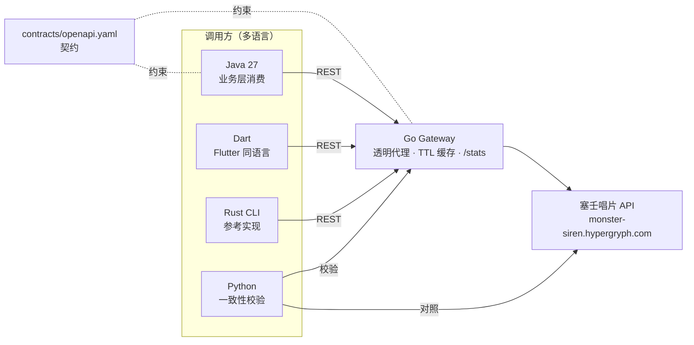

# demo/ — 最小多语言闭环验证

> 目的：用最小成本验证 RS 重构的总体方向是否可行 ——
> **契约驱动 + 多语言客户端 + Go 接入层 + 容器化**。
> 不包含歌词动画、登录系统、UI 等细节，只验证调用链、契约与跨语言一致性。

## 调用链



## 验证点与结果

| 验证点 | 实现方式 | 结果 |
|--------|----------|------|
| Java 能消费塞壬数据 | `java-client`：JDK HttpClient + Gson 按契约反序列化 | 通过 |
| Go 能承担接入层 / BFF | `go-gateway`：透明代理 + TTL 缓存 + 结构化日志 + `/healthz`、`/stats` | 通过 |
| Flutter 同语言可接入 | `dart-client`：Dart 走同一网关 | 通过 |
| Rust 参考实现可对照 | `tools/siren-ref` 直连 vs 经网关，JSON 完全一致 | 通过 |
| 契约驱动可行 | `contracts/openapi.yaml` 声明全部端点，校验器按契约检查 | 通过 |
| 跨语言数据一致性 | 6 个接口的网关响应与上游响应规范化后逐字节一致 | 通过 |
| 容器化可行 | Docker 多阶段构建（scratch + CA 证书），镜像 10.7 MB | 通过 |

## 目录结构

```
demo/
├── run.sh                     # 一键跑通（--docker 用容器跑网关）
├── contracts/
│   └── openapi.yaml           # 契约（唯一真相源）
├── go-gateway/                # Go：塞壬 API 缓存网关（BFF）
│   ├── go.mod
│   ├── main.go
│   ├── main_test.go           # 缓存命中/查询串透传 单元测试
│   └── Dockerfile
├── java-client/               # Java：业务层消费方
│   └── src/demo/App.java
├── dart-client/               # Dart：Flutter 同语言消费方
│   └── bin/main.dart
├── python-verify/             # Python：一致性 + 契约校验
│   └── verify.py
├── scripts/
│   └── fetch-siren-data.sh    # 用 Rust 工具抓取真实数据为 fixtures
├── fixtures/                  # 生成物（gitignore）
└── out/                       # 生成物（gitignore）
```

## 如何运行

### 前置条件

| 工具 | 验证版本 | 用途 |
|------|----------|------|
| Rust / Cargo | 1.8x+ | 构建 `tools/siren-ref` |
| Go | 1.27.1 | 网关 |
| JDK | 27（17+ 即可） | Java 客户端 |
| Dart SDK | 3.13.2 | Dart 客户端 |
| Python | 3.14（含 PyYAML） | 校验器 |
| curl / jq | 任意 | 脚本编排 |
| Docker | 29（可选） | `--docker` 模式 |

需要能访问 `monster-siren.hypergryph.com`。

### 一键运行

```bash
bash demo/run.sh            # 本机运行 Go 网关
bash demo/run.sh --docker   # 用 Docker 容器运行 Go 网关

# 单独抓取真实数据（Rust 参考工具 -> demo/fixtures/）
bash demo/scripts/fetch-siren-data.sh
```

`run.sh` 依次执行：构建 Rust 工具 → `go test` + 构建网关 → 编译 Java 客户端 → 启动网关 → Java / Dart / Rust / Python 四路验证 → 汇总产物到 `demo/out/`。

### 单独运行各组件

```bash
# 网关（默认 :8080，上游可换）
cd demo/go-gateway && go run . -port 8080

# Java 客户端
javac -cp demo/java-client/lib/gson-2.11.0.jar -d demo/out/java-classes demo/java-client/src/demo/App.java
java -cp demo/java-client/lib/gson-2.11.0.jar:demo/out/java-classes demo.App demo/out

# Dart 客户端
dart demo/dart-client/bin/main.dart

# Rust 参考 CLI（经网关）
cargo run -p siren-ref -- --base-url http://127.0.0.1:8080 albums

# Python 校验
python3 demo/python-verify/verify.py
```

## 实测输出（2026-09-22）

```text
== Java 客户端 ==
[1] /healthz -> HTTP 200 {"status":"ok",...}
[2] /api/albums -> HTTP 200, cache=MISS, albums=294
    - 逐影集趣ost (0232) / 塞壬唱片-MSR
    - 月行水上 (7760) / 塞壬唱片-MSR
[3] /api/album/0232/detail -> 逐影集趣ost, songs=1
[4] /api/albums 二次调用 -> cache=HIT (期望 HIT)
[5] /stats -> {"cache":{"entries":2,"hits":1,"misses":2,"ttl_seconds":300},...}
[OK] Java 链路通过

== Dart 客户端 ==
[1] /api/albums -> cache=HIT, albums=294
[2] /api/album/0232/detail -> 逐影集趣ost, songs=1
[OK] Dart 链路通过

== Rust 参考 CLI ==
[OK] Rust 直连与经网关响应一致

== Python 一致性校验 + 契约检查 ==
[OK] /api/albums  /api/songs  /api/news  /api/search  /api/album/{cid}/detail  /api/song/{cid}
[OK] /healthz  /stats  /api/albums  /api/songs  /api/news  /api/search
结果：全部通过
```

Docker 模式：

```text
monster-player-demo-gateway:latest  10.7MB
（golang:1.27-alpine 构建 -> scratch 运行，仅拷贝 CA 证书与静态二进制）
```

## 与目标架构的映射

| demo 组件 | 目标架构角色 | 正式方案 |
|-----------|--------------|----------|
| Go 网关内存缓存 | Redis 缓存 | Redis（会话、热点缓存） |
| Go 网关 `/stats` | 计数 / 数据统计 | Redis 计数 + Prometheus 指标 |
| `contracts/openapi.yaml` 手工维护 | 契约唯一真相源 | OpenAPI + gRPC/Protobuf + AsyncAPI，生成各语言 SDK |
| REST 内部调用 | Java ↔ Go 通信 | gRPC + Protobuf |
| 无 | 异步事件 | Kafka（播放事件、点赞、评论、通知） |
| 无 | 核心业务数据 | PostgreSQL + Flyway |
| Dart CLI | Flutter 客户端 | Flutter 三端 + 自研歌词动画引擎 |
| 无 | 账号体系 | 鹰角通行证 OAuth2 + Spring Security |
| Go 标准库路由 | 接入层框架 | Gin / Echo + 限流 + 熔断 + 服务网格 |
| 单容器 | 编排 | Kubernetes + Helm |

## 为什么这样取舍

- **Java 不用 Spring Boot / Maven**：本机没有 Maven，且目标是验证调用链而不是框架；用 JDK HttpClient + 单 jar（Gson）把依赖压到最小。正式方案仍是 Spring Boot 3 + Maven/Gradle。
- **Go 不用 Gin/Echo**：`net/http` + `log/slog` 已足够验证代理、缓存、日志三件事，且零第三方依赖（`go test` 离线可跑）。正式方案再引入 Gin/Echo。
- **Dart 而不是 Flutter**：环境未安装 Flutter，且 UI 细节明确排除；Dart 层与 Flutter 客户端同语言、同网络栈，足以验证客户端接入路径。
- **没有 Redis / Kafka / PostgreSQL**：它们属于"规模化"能力，最小闭环不依赖；用内存缓存与 `/stats` 占位，映射关系见上表。
- **契约不生成代码**：生成 SDK 需要 openapi-generator 等重型工具，最小验证先证明"契约可描述、可校验、可对齐"。

## 结论

最小闭环可行，理由：

1. **调用链成立**：Java → Go 网关 → 塞壬 API 三段全部跑通，业务错误码、中文数据、分页结构都能正确透传；
2. **契约成立**：一份 OpenAPI 可以同时约束 Go 网关与 Java / Dart 消费方，Python 校验器能自动核对；
3. **跨语言一致**：Rust、Java、Dart、Python 四种实现拿到的数据与上游完全一致，说明"契约是唯一真相源"在工程上可落地；
4. **容器化成立**：网关静态编译后 10.7 MB 镜像即可运行，符合云原生部署方向。

## 下一步建议

1. `contracts/openapi.yaml` 正式化：拆分为用户 / 收藏 / 评论 / 播放事件等领域契约，接入 openapi-generator 生成 Java、Dart、Go SDK；
2. Go 网关升级：Gin/Echo + Redis + 限流 + 熔断，并接入 OpenTelemetry；
3. Java 侧升级：Spring Boot 3 + Flyway + Spring Security，先做账号与收藏；
4. 打通 gRPC：Java ↔ Go 用 Protobuf 通信，替换 demo 中的 REST 内部调用；
5. 接入 Kafka：播放事件先走 Outbox，再消费进 Redis 排行榜；
6. Flutter 客户端立项：从"专辑列表 + 播放 + 基础歌词"三件事开始。
