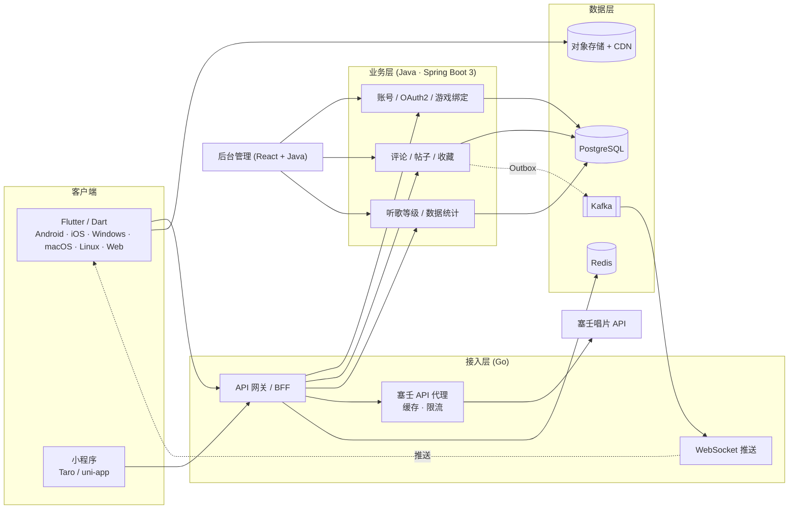

# monster-player RS · 第三次重构总体规划

> 状态：**规划中**（尚未开始实现）
> 分支：`new_ms` · 版本标签：`RS-v`
> 本文档是完整规划；[README](../README_zh.md) 只保留摘要。

---

## 1. 背景与定位

monster-player 已走过两代形态：

| 代际 | 形态 | 结论 |
|------|------|------|
| 第一代 | Rust 单内核 + TUI（ratatui） | 验证了终端播放体验与渐进式流播 |
| 第二代 | 共享内核 + TUI / GUI（egui）双前端 | 验证了"内核复用"与 C FFI、Python 绑定 |

第三代是一次彻底重建，目标不再是"能播放"，而是**一个跨三端、有在线服务能力、可长期演进的音乐产品**：

- **客户端**：Dart + Flutter，一套代码覆盖 Android / iOS / Windows / macOS / Linux / Web，自绘引擎保证歌词动画丝滑
- **服务端**：Java（业务中台）+ Go（高并发接入）+ Rust / Python / Node.js（预留）
- **数据层**：PostgreSQL 保核心、Redis 抗并发、Kafka 削峰解耦
- **工程方法**：契约驱动（OpenAPI / gRPC + Protobuf / AsyncAPI），容器化部署
- **发行方式**：独立发行版，版本标签 `RS-v`，与旧版 `main` 并行维护

## 2. 总体架构



### 分层职责

| 层 | 技术 | 职责 |
|----|------|------|
| 客户端 | Flutter / Dart | 播放、歌词动画、离线缓存、社交与账号界面 |
| 接入层 | Go | API 网关、BFF、播放事件同步、计数、排行榜、塞壬 API 代理、WebSocket 推送 |
| 业务层 | Java / Spring Boot 3 | 用户账号、鹰角通行证 OAuth2、游戏账号绑定、评论区、帖子、听歌等级、后台管理、数据统计 |
| 预留能力 | Rust | 音频处理、转码 |
| 预留能力 | Python | AI 推荐、数据分析 |
| 预留能力 | Node.js | BFF 聚合层 |
| 数据层 | PostgreSQL / Redis / Kafka | 核心业务数据、缓存与排行榜、异步事件 |

## 3. 客户端规划

### 3.1 三端同源

一套 Flutter 代码同时产出 Android、iOS、Windows、macOS、Linux、Web 六个平台产物；小程序端由 Taro / uni-app + TypeScript 承担。客户端本地库使用 Drift（SQLite），承载缓存记录、播放事件 outbox 与离线数据。

### 3.2 客户端核心抽象接口

所有能力按"接口 + 可替换实现"组织，通过 PluginRegistry 挂载：

| 接口 | 作用 | 可替换实现 |
|------|------|-----------|
| `PlayerEngine` | 播放引擎 | just_audio、原生 ExoPlayer、AVPlayer |
| `LyricRenderer` | 歌词渲染 | LRC、逐字、艺术动画、未来新样式 |
| `CachePolicy` | 缓存策略 | LRU、PIN、流式、仅 Wi-Fi |
| `SyncAdapter` | 同步协议 | REST、gRPC、WebSocket |
| `AuthProvider` | 认证提供方 | 鹰角通行证、手机号、第三方 OAuth |
| `GameDataProvider` | 游戏数据 | 明日方舟、其他鹰角游戏 |
| `SocialProvider` | 社交能力 | 评论、点赞、收藏、帖子 |
| `Plugin` + `PluginRegistry` | 插件注册 | 新模块像插件一样挂载 |

### 3.3 歌词动画引擎

自研时间戳歌词动画引擎是客户端投入最大的部分：

- 逐行 LRC 与逐字时间戳两种精度模型
- 基于 Flutter 自绘（CustomPainter / Canvas）的渲染管线，绕开平台控件限制
- 动画曲线、发光、粒子、渐变等效果按 `LyricRenderer` 接口组合
- 与播放进度高精度同步（帧对齐 + 插值补偿）

## 4. 服务端规划

### 4.1 Java 技术栈

| 能力 | 技术 |
|------|------|
| 框架 | Spring Boot 3 |
| 模块化 | Spring Modulith |
| 认证 | Spring Security OAuth2 |
| ORM | Spring Data JPA / MyBatis-Plus |
| 数据库迁移 | Flyway |
| 事件 | Kafka Producer/Consumer + Outbox |
| 构建 | Maven 或 Gradle |

### 4.2 Go 技术栈

| 能力 | 技术 |
|------|------|
| Web 框架 | Gin 或 Echo |
| ORM | GORM 或 sqlc |
| Redis | go-redis |
| Kafka | sarama 或 franz-go |
| gRPC | google.golang.org/grpc |
| WebSocket | gorilla/websocket |
| 配置 | Viper |
| 构建 | Go Modules |

### 4.3 服务端核心抽象接口

| 接口 | 作用 |
|------|------|
| `ModulePlugin` | 模块注册（module_id、version、status） |
| `PlaybackEventPublisher` | 播放事件发布 |
| `RankingStrategy` | 排行榜策略 |
| `LevelRule` | 等级规则 |
| `AuthProvider` | 认证提供方 |
| `GameAccountProvider` | 游戏账号数据 |
| `SearchProvider` | 搜索引擎 |
| `NotificationChannel` | 通知渠道 |
| `StorageProvider` | 存储后端 |
| `RiskRule` | 风控规则 |

## 5. 数据层

| 组件 | 用途 | 说明 |
|------|------|------|
| PostgreSQL | 核心业务数据 | 用户、游戏绑定、评论、收藏、等级、播放事件 |
| Redis | 缓存 + 排行榜 + 计数 | 会话、ZSet 排行榜、点赞计数、热点缓存 |
| Kafka | 异步事件 | 播放事件、点赞、评论、通知，削峰解耦 |
| SQLite (Drift) | 客户端本地库 | 缓存记录、播放事件 outbox、离线数据 |
| 对象存储 + CDN | 音频、封面、歌词分发 | S3 / OSS + CDN |
| Elasticsearch（可选） | 全文搜索 | 歌曲、用户、帖子搜索 |

## 6. 跨语言契约

| 契约 | 技术 | 用途 |
|------|------|------|
| REST API | OpenAPI 3.0 | 对外接口，自动生成各语言 SDK |
| 内部通信 | gRPC + Protobuf | Java ↔ Go ↔ 未来语言，高性能强类型 |
| 异步事件 | AsyncAPI | Kafka 事件 schema，新模块订阅 |
| 通用 Schema | JSON Schema | 播放事件、用户操作等 |

**契约是唯一真相源。** 所有语言从 `contracts/` 生成 SDK，不手写接口定义。任何语言（包括 Rust）都不承担接口定义角色，只消费契约。

## 7. 基础设施与运维

| 能力 | 技术 |
|------|------|
| 容器化 | Docker |
| 编排 | Kubernetes |
| 服务网格 | Istio / Linkerd |
| API 网关 | Kong / Envoy / APISIX |
| 服务发现 | K8s Service + DNS / Consul |
| 多语言构建 | Bazel（Monorepo）或 GitHub Actions 统一调度 |
| CI/CD | GitHub Actions / GitLab CI |
| 链路追踪 | OpenTelemetry |
| 指标监控 | Prometheus + Grafana |
| 日志 | Loki + 结构化 JSON |
| 配置中心 | Nacos / Apollo / Consul |
| 功能开关 | Unleash / FF4J / 自研 |

## 8. 后台管理

| 部分 | 技术 |
|------|------|
| 前端 | React + Ant Design / Arco Design |
| 后端 | Java Spring Boot |
| 权限 | Spring Security |
| 数据导出 | EasyExcel / POI |

## 9. 外部对接

| 对接方 | 方式 |
|--------|------|
| 鹰角网络通行证 | OAuth 2.0 / OpenID Connect |
| 塞壬唱片 API | REST 代理 + 缓存 + 限流 |
| 明日方舟等游戏账号 | 官方 API（后期合作） |
| 推送服务 | FCM / APNs / 厂商推送 |
| CDN | 阿里云 CDN / Cloudflare |

## 10. 最终技术栈总表

| 层次 | 技术选型 |
|------|----------|
| 客户端（App/桌面/Web） | Flutter + Dart |
| 客户端（小程序） | Taro / uni-app + TypeScript |
| 客户端本地库 | Drift (SQLite) |
| 后端（业务） | Java + Spring Boot 3 |
| 后端（高并发） | Go + Gin/Echo |
| 后端（预留） | Rust、Python、Node.js |
| 关系数据库 | PostgreSQL |
| 缓存/排行 | Redis |
| 消息队列 | Kafka |
| 搜索 | Elasticsearch（可选） |
| 对象存储 | S3 / OSS + CDN |
| 契约 | OpenAPI + gRPC/Protobuf + AsyncAPI |
| 容器 | Docker |
| 编排 | Kubernetes |
| 服务网格 | Istio |
| API 网关 | Kong / Envoy / APISIX |
| 多语言构建 | Bazel 或 CI 统一调度 |
| 可观测性 | OpenTelemetry + Prometheus + Grafana + Loki |
| 配置/开关 | Nacos / Apollo + Unleash |
| 后台前端 | React + Ant Design |

## 11. 目标仓库结构

```
monster-player/
├── clients/
│   └── flutter/          # Flutter 客户端（三端同源）
├── services/
│   ├── java/             # Spring Boot 业务服务
│   ├── go/               # 网关 / BFF / 事件 / 塞壬代理
│   ├── rust/             # 预留：音频处理、转码
│   └── python/           # 预留：AI 推荐、数据分析
├── contracts/            # 契约唯一真相源（OpenAPI / Protobuf / AsyncAPI）
├── admin/                # 后台管理前端（React + Ant Design）
├── deploy/               # Docker / Kubernetes / Helm
├── tools/
│   └── siren-ref/        # 塞壬 API 参考实现（Rust CLI）
└── docs/                 # 规划与接口文档
```

> 注：本分支当前只有 `contracts/`、`docs/`、`tools/siren-ref/` 已落地，其余目录随里程碑逐步创建。

## 12. 当前分支保留资产

| 资产 | 说明 |
|------|------|
| [`docs/monster-siren-api.md`](monster-siren-api.md) | 塞壬唱片 API 契约知识：端点、字段、错误码、CDN 直链格式 |
| [`tools/siren-ref`](../tools/siren-ref) | 经过验证的 Rust 参考客户端（CLI）：拉取真实响应生成 JSON fixture，供契约测试与网关对照验证 |
| [`contracts/`](../contracts) | 契约目录占位与约定说明 |
| [`LICENSE`](../LICENSE) | MIT 许可证 |

已移除（可从 `main` 分支与 Releases 找回）：旧 Rust 内核（kernel / player / config）、TUI 与 GUI 前端、C FFI 绑定、Python bindings、AUR 打包、旧 CI、演示素材。

### 为什么保留一个 Rust 工具

新架构中 Rust 不再承担接口角色 —— 契约（OpenAPI / Protobuf / AsyncAPI）是唯一真相源，塞壬代理由 Go 实现。但旧 Rust 客户端是一份**经过真实数据验证**的塞壬 API 参考实现，因此精简为 `tools/siren-ref`：

- 拉取真实响应生成契约测试 fixture
- 作为 Go 代理实现的对照物（`--base-url` 可指向未来的 Go 网关，对比响应差异）
- 与"Rust 预留：音频处理、转码"的技术栈定位一致

## 13. 里程碑

| 阶段 | 内容 | 验收标准 |
|------|------|----------|
| P0 契约与骨架 | contracts 初始化、CI、代码生成流水线、仓库目录成型 | 三个语言的 SDK 可由契约一键生成 |
| P1 Go 接入层 | API 网关 / BFF、塞壬 API 代理（缓存 + 限流）、WebSocket 通道 | 客户端可经网关完成登录、取数与推送 |
| P2 Java 业务层 | 账号、鹰角通行证 OAuth2、游戏绑定、收藏、评论、帖子 | 核心社交闭环可用，Flyway 迁移可回放 |
| P3 Go 高并发 | 播放事件同步、计数、Redis 排行榜 | 播放事件端到端可达，排行榜实时更新 |
| P4 Flutter 客户端 | 三端壳工程、播放引擎、歌词动画引擎 | Android / 桌面 / Web 三端可播放并展示歌词动画 |
| P5 数据与运维 | Kafka 事件、可观测性、Docker / K8s 部署 | 一键部署到 K8s，Trace / Metrics / Logs 齐全 |
| P6 后台与统计 | 后台管理、数据统计、数据导出 | 运营可在后台完成内容与用户管理 |

## 14. 参考

- [塞壬唱片 API 契约知识](monster-siren-api.md)
- [契约目录约定](../contracts/README.md)
- [塞壬 API 参考 CLI](../tools/siren-ref)
